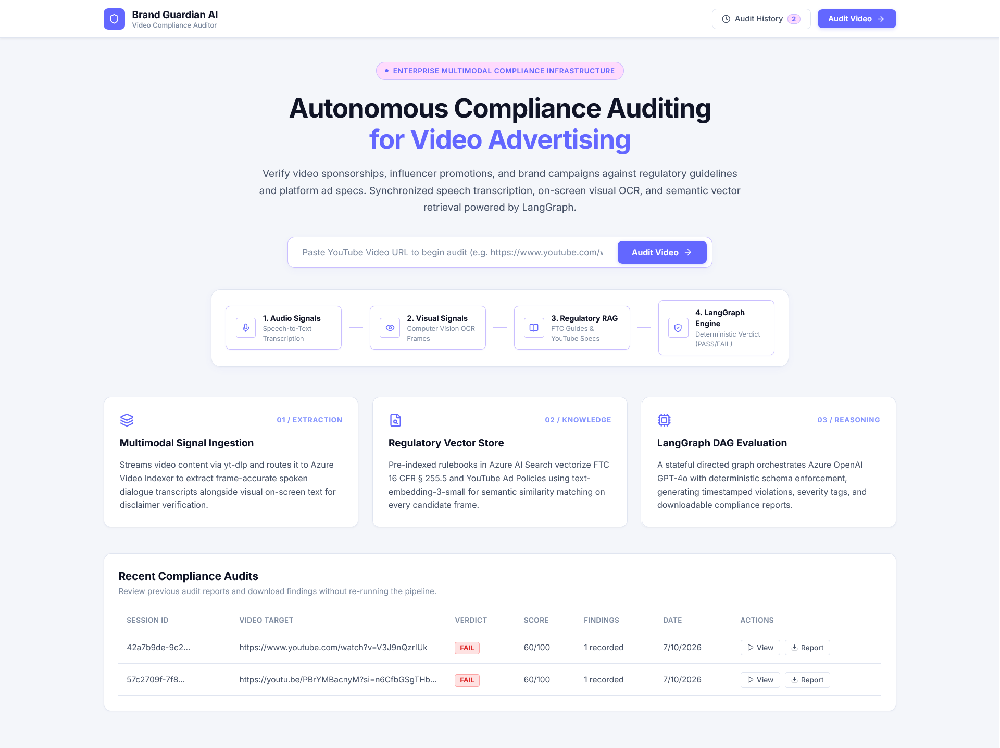
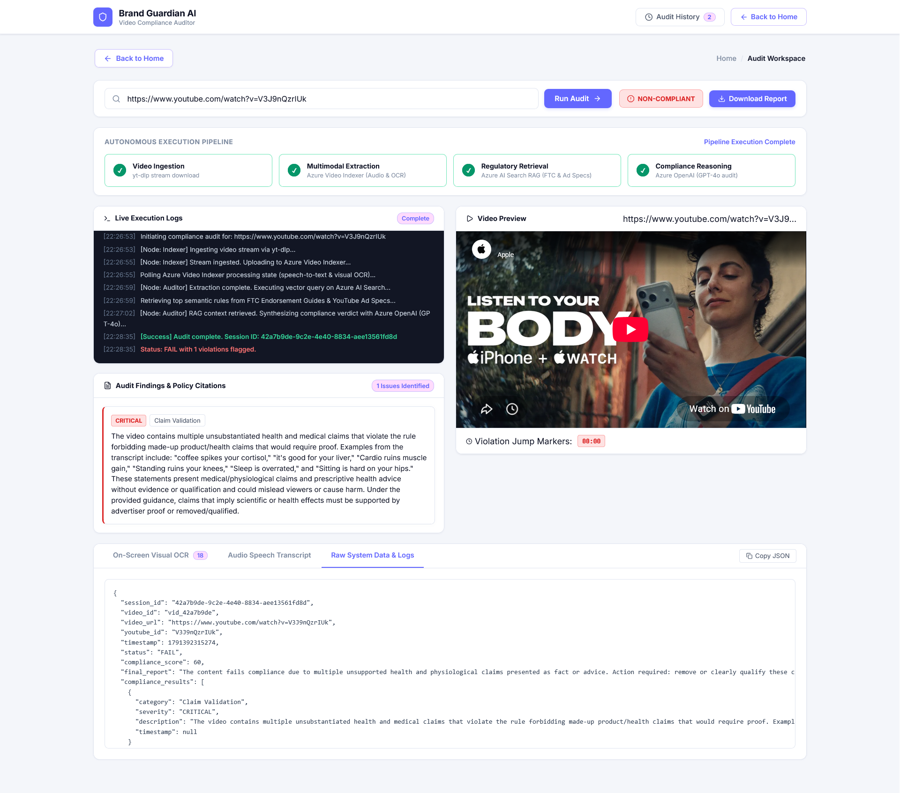
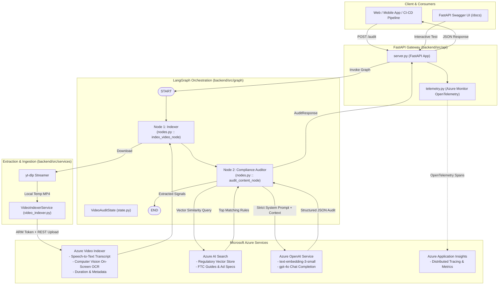
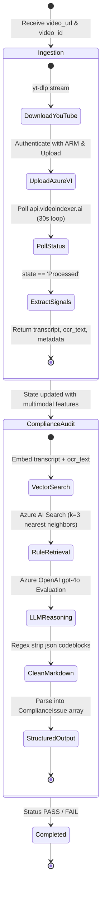
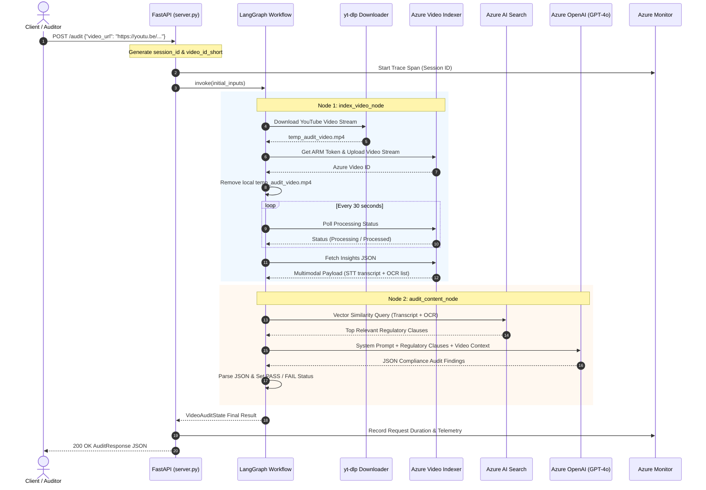
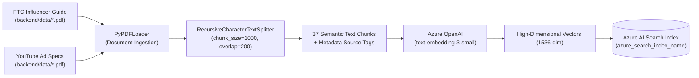

# Brand Guardian AI — Automated Video Compliance & Audit Engine

[](https://www.python.org/)
[](https://fastapi.tiangolo.com/)
[](https://github.com/langchain-ai/langgraph)
[](https://azure.microsoft.com/en-us/products/ai-services/ai-search)
[](https://azure.microsoft.com/en-us/products/video-indexer)
[-0078D4.svg?logo=openai&logoColor=white)](https://azure.microsoft.com/en-us/products/ai-services/openai-service)
[](https://opentelemetry.io/)
[](https://opensource.org/licenses/MIT)

---

<p align="center">
  
</p>

<p align="center">
  <em>Autonomous multimodal video auditing in action: Stream ingestion &rarr; Azure Video Indexer &rarr; Azure AI Search &rarr; GPT-4o compliance reasoning with synchronized jump-to-timestamp playback.</em>
</p>

---

## Executive Overview

**Brand Guardian AI** is an enterprise-grade automated multimodal auditing system engineered to assess video marketing content against brand guidelines, regulatory mandates (e.g., **FTC Endorsement Guides**), and platform advertising specifications (e.g., **YouTube Ad Specs**).


By combining **Azure Video Indexer** for multimodal signal extraction (speech-to-text transcription and computer vision OCR), **Azure AI Search** for Retrieval-Augmented Generation (RAG) over regulatory rulebooks, and a stateful **LangGraph** orchestration graph powered by **Azure OpenAI (GPT-4o)**, the system performs autonomous, frame-accurate compliance auditing with strict structured JSON output and enterprise-wide distributed tracing.

---

## Key Capabilities

- **Multimodal Video Ingestion & Extraction**: Ingests video content via [yt-dlp](https://github.com/yt-dlp/yt-dlp) and streams it to **Azure Video Indexer** using Azure Managed Identity (`DefaultAzureCredential`) to extract speech transcripts, on-screen text (OCR), and metadata.
- **RAG-Powered Regulatory Intelligence**: Vectorizes regulatory PDFs into 1,000-character semantic chunks using Azure OpenAI `text-embedding-3-small` and performs vector similarity search via **Azure AI Search**.
- **Stateful Directed Acyclic Graph (DAG)**: Leverages **LangGraph** to decouple ingestion, extraction, and compliance evaluation into isolated, observable nodes with typed state transitions (`VideoAuditState`).
- **Deterministic Schema Enforcement**: Enforces structured JSON output (`AuditResponse`, `ComplianceIssue`) with strict categorization (`Claim Validation`, `FTC_DISCLOSURE`, `Platform Specs`) and severity tagging (`CRITICAL`, `WARNING`).
- **Zero-Friction Observability**: Native integration with **Azure Monitor** and **Application Insights** via OpenTelemetry, tracking HTTP request lifecycles, database latency, and LLM call durations.
- **Production-Ready REST API**: High-throughput asynchronous API built on **FastAPI**, featuring automatic OpenAPI / Swagger interactive documentation, schema validation, and health checks.
- **Enterprise Web Interface**: Modern, accessible React + Vite dashboard featuring synchronized video timestamp jumping, live execution console, multimodal tabs, and persistent audit history.

---

## User Interface & Interactive Workspace

Brand Guardian AI includes a high-performance web application designed with a clean, accessible **Moon-Silver & Lavender** visual system (`#6367FF`, `#8494FF`, `#C9BEFF`, `#FFDBFD`) — free from visual clutter, neon glows, or emojis.

| **Home Overview & Architecture Pillars** | **Audit Workspace & Synchronized Player** |
|:---:|:---:|
|  |  |
| *System architecture cards, recent audit history, and 1-click test runs.* | *4-step pipeline stepper, live terminal logs, jump markers, OCR & transcript inspector.* |

### Key Frontend Features
- **Synchronized Video Player**: Interactive timestamp badges (`00:15`, `00:32`) instantly command the embedded video player to seek directly to offending frames.
- **Multimodal Evidence Inspector**: Dedicated tabbed inspector displaying frame-by-frame **On-Screen Visual OCR** cards, verbatim **Audio Speech Transcripts**, and raw system payloads.
- **Live Execution Console**: Real-time terminal output reflecting LangGraph state transitions (`[Node: Indexer]`, `[Node: Auditor]`, vector search queries).
- **Persistent History & Markdown Reports**: Store previous audit runs locally, reload past verdicts with one click, and export audit reports as downloadable `.md` files.

---

## Architecture & System Design

### 1. High-Level Enterprise Architecture



---

### 2. LangGraph State Machine & Workflow

The core evaluation logic is orchestrated as a directed state machine defined in [`backend/src/graph/workflow.py`](file:///c:/PROJECTS/L-Bay%20Projects/Video%20Audit%20Project/backend/src/graph/workflow.py) operating over [`VideoAuditState`](file:///c:/PROJECTS/L-Bay%20Projects/Video%20Audit%20Project/backend/src/graph/state.py).



---

### 3. End-to-End Sequence Diagram



---

### 4. Knowledge Base Vector Store ETL Pipeline

The vector database is populated ahead of time using [`backend/scripts/index_documents.py`](file:///c:/PROJECTS/L-Bay%20Projects/Video%20Audit%20Project/backend/scripts/index_documents.py):



---

## Repository Structure & Anatomy

```plaintext
video-audit-project/
├── .env                                  # Local environment configuration (API keys, endpoints)
├── .gitignore                            # Excludes venv, pycache, build artifacts
├── .python-version                       # Pinned Python version (3.10)
├── pyproject.toml                        # Project metadata and package manager manifest
├── README.md                             # Comprehensive production documentation
│
├── assets/                               # Media documentation assets
│   ├── app_working.gif                   # Full end-to-end audit demonstration GIF
│   ├── home_page.png                     # Home overview and pipeline cards screenshot
│   └── audit_page.png                    # Live audit workspace, video player, and OCR inspector
│
├── frontend/                             # Enterprise React + Vite web dashboard
│   ├── index.html                        # HTML entry point
│   ├── package.json                      # Frontend dependencies & scripts
│   ├── vite.config.js                    # Vite configuration with /api reverse proxy
│   └── src/
│       ├── App.jsx                       # Root application view & state manager
│       ├── App.css                       # Moon-silver & lavender design system
│       ├── components/                   # Modular UI components
│       │   ├── Navbar.jsx                # Header bar, brand logo, history counter & back button
│       │   ├── HomeScreen.jsx            # Architecture hero banner, pipeline cards, recent audits
│       │   ├── AuditWorkspace.jsx        # Stepper, video player, terminal console, multimodal tabs
│       │   ├── HistoryModal.jsx          # Audit session storage viewer with 1-click reload
│       │   └── ReportModal.jsx           # Completion report modal with instant markdown download
│       └── services/
│           ├── api.js                    # FastAPI client & localStorage history manager
│           └── reportGenerator.js        # Downloadable compliance markdown exporter
│
├── backend/                              # Core backend microservice
│   ├── Dockerfile                        # Multi-stage production container definition
│   │
│   ├── data/                             # Regulatory documents & platform rulebooks
│   │   ├── 1001a-influencer-guide-508_1.pdf  # FTC Endorsement Guides & Disclosure rules
│   │   └── youtube-ad-specs.pdf              # YouTube Video Ad specifications & policies
│   │
│   ├── scripts/                          # Administration & indexing scripts
│   │   ├── explanation.txt               # Memory/vector indexing validation breakdown
│   │   └── index_documents.py            # ETL script: PDF parsing, chunking, and Azure Search indexing
│   │
│   ├── src/                              # Backend source package
│   │   ├── api/                          # REST API layer
│   │   │   ├── __init__.py               # Package marker
│   │   │   ├── server.py                 # FastAPI application, Pydantic models, /audit & /health
│   │   │   └── telemetry.py              # Azure Monitor OpenTelemetry configuration & tracing
│   │   │
│   │   ├── graph/                        # LangGraph orchestration engine
│   │   │   ├── __init__.py               # Package marker
│   │   │   ├── nodes.py                  # Node logic: index_video_node & audit_content_node
│   │   │   ├── state.py                  # State definitions: VideoAuditState & ComplianceIssue
│   │   │   └── workflow.py               # StateGraph DAG composition and compilation
│   │   │
│   │   └── services/                     # External integration clients
│   │       ├── __init__.py               # Package marker
│   │       └── video_indexer.py          # Azure Video Indexer API & yt-dlp client
│   │
│   └── tests/                            # Unit and integration test suites
│
└── src/                                  # Top-level application package
    └── video_audit_project/
        └── __init__.py                   # CLI entrypoint
```

---

## State Model & Data Schemas

### LangGraph State Schema (`backend/src/graph/state.py`)

The global execution context passed between graph nodes is defined as a typed dictionary:

```python
class ComplianceIssue(TypedDict):
    category: str            # e.g., "FTC_DISCLOSURE", "Claim Validation", "Ad Specs"
    description: str         # Precise narrative detailing the violation
    severity: str            # "CRITICAL" | "WARNING"
    timestamp: Optional[str] # Timestamp of occurrence in the video (e.g., "00:01:24")

class VideoAuditState(TypedDict):
    # Input parameters
    video_url: str
    video_id: str

    # Extracted multimodal features
    local_file_path: Optional[str]
    video_metadata: Dict[str, Any]  # e.g., {"duration": 182, "platform": "youtube"}
    transcript: Optional[str]       # Full speech-to-text transcript
    ocr_text: List[str]             # List of recognized on-screen text frames

    # Evaluation results (Aggregated via operator.add)
    compliance_results: Annotated[List[ComplianceIssue], operator.add]
    final_status: str               # "PASS" | "FAIL"
    final_report: str               # Executive markdown report

    # Error isolation
    errors: Annotated[List[str], operator.add]
```

---

## Prerequisites & Azure Setup

Ensure you have active Azure subscriptions and resources provisioned before deploying:

1. **Azure Video Indexer (VI)**:
   - Create an Azure Video Indexer account linked to an Azure Media Services / Azure Storage account.
   - Note your `AZURE_VI_ACCOUNT_ID`, `AZURE_VI_NAME`, `AZURE_VI_LOCATION`, `AZURE_RESOURCE_GROUP`, and `AZURE_SUBSCRIPTION_ID`.
   - Ensure the identity running this service has `Contributor` role access to generate access tokens.
2. **Azure AI Search**:
   - Deploy an Azure AI Search service (Basic or Standard tier).
   - Note the search endpoint (`AZURE_SEARCH_ENDPOINT`) and Admin API Key (`AZURE_SEARCH_API_KEY`).
3. **Azure OpenAI Service**:
   - Deploy an Azure OpenAI instance in a region supporting **GPT-4o** and **text-embedding-3-small**.
   - Note deployment names:
     - Chat Model: `gpt-4o` (or your custom deployment name).
     - Embedding Model: `text-embedding-3-small`.
4. **Azure Application Insights (Optional but recommended)**:
   - Provision an Application Insights instance for OpenTelemetry ingestion.
   - Note the `APPLICATIONINSIGHTS_CONNECTION_STRING`.

---

## Environment Configuration (`.env`)

Create a `.env` file in the project root based on the following specification:

| Variable | Description | Example / Format |
|---|---|---|
| `AZURE_OPENAI_API_KEY` | Azure OpenAI API Key | `3fa85f64c9...` |
| `AZURE_OPENAI_ENDPOINT` | Azure OpenAI endpoint URL | `https://your-resource.openai.azure.com/` |
| `AZURE_OPENAI_API_VERSION` | API version for Azure OpenAI | `2024-02-01` or `2024-12-01-preview` |
| `AZURE_OPENAI_CHAT_DEPLOYMENT` | Deployment name for GPT-4o | `gpt-4o` |
| `AZURE_OPENAI_EMBEDDING_DEPLOYMENT` | Deployment name for Embeddings | `text-embedding-3-small` |
| `AZURE_SEARCH_ENDPOINT` | Azure AI Search service URL | `https://your-search.search.windows.net` |
| `AZURE_SEARCH_API_KEY` | Azure AI Search Admin Key | `4A9D...` |
| `AZURE_SEARCH_INDEX_NAME` | Vector index name in Azure Search | `brand-guardian-rules` |
| `AZURE_VI_NAME` | Azure Video Indexer resource name | `project-brand-guardian-001` |
| `AZURE_VI_LOCATION` | Video Indexer region | `eastus` or `trial` |
| `AZURE_VI_ACCOUNT_ID` | Azure Video Indexer Account GUID | `00000000-0000-0000-0000-000000000000` |
| `AZURE_SUBSCRIPTION_ID` | Azure Subscription ID GUID | `00000000-0000-0000-0000-000000000000` |
| `AZURE_RESOURCE_GROUP` | Azure Resource Group name | `rg-brand-guardian` |
| `APPLICATIONINSIGHTS_CONNECTION_STRING` | Azure App Insights connection string | `InstrumentationKey=...;IngestionEndpoint=...` |
| `LANGCHAIN_TRACING_V2` | Enable LangSmith tracing | `true` or `false` |
| `LANGCHAIN_API_KEY` | LangSmith API Key (Optional) | `lsv2_pt_...` |
| `LANGCHAIN_PROJECT` | LangSmith Project Name (Optional) | `brand-guardian-ai` |

---

## Installation & Quickstart

### Step 1: Clone and Set Up Virtual Environment

We recommend [uv](https://docs.astral.sh/uv/) for high-speed package management:

```bash
# Clone the repository
git clone https://github.com/your-org/video-audit-project.git
cd video-audit-project

# Create a virtual environment with Python 3.10
uv venv --python 3.10
# Activate environment (Windows PowerShell)
.venv\Scripts\activate
# Or Linux/macOS:
# source .venv/bin/activate

# Install required dependencies
uv pip install fastapi "uvicorn[standard]" pydantic python-dotenv \
    langchain langchain-community langchain-core langchain-openai \
    langchain-text-splitters langgraph pypdf yt-dlp requests \
    azure-identity azure-search-documents azure-monitor-opentelemetry
```

### Step 2: Index the Regulatory Knowledge Base

Before auditing videos, build the vector index with the provided regulatory PDFs:

```bash
python backend/scripts/index_documents.py
```

Expected output:
```text
2026-10-05 16:15:00 - INFO - Environment Configuration Check: ...
2026-10-05 16:15:01 - INFO - ✓ Embeddings model initialized successfully
2026-10-05 16:15:01 - INFO - ✓ Vector store initialized for index: brand-guardian-rules
2026-10-05 16:15:02 - INFO - Found 2 PDFs to process: ['1001a-influencer-guide-508_1.pdf', 'youtube-ad-specs.pdf']
2026-10-05 16:15:03 - INFO -  -> Split into 11 chunks.
2026-10-05 16:15:04 - INFO -  -> Split into 26 chunks.
2026-10-05 16:15:08 - INFO - ✅ Indexing Complete! The Knowledge Base is ready. Total chunks indexed: 37
```

### Step 3: Launch the API Server

Start the FastAPI application with auto-reload:

```bash
uv run uvicorn backend.src.api.server:app --reload --host 0.0.0.0 --port 8000
```

Once running:
- **Interactive Swagger UI**: [http://localhost:8000/docs](http://localhost:8000/docs)
- **ReDoc Documentation**: [http://localhost:8000/redoc](http://localhost:8000/redoc)
- **Health Check Probe**: [http://localhost:8000/health](http://localhost:8000/health)

### Step 4: Launch the Frontend Web Dashboard

In a second terminal window, start the React + Vite frontend:

```bash
cd frontend
npm install
npm run dev
```

Once running:
- **Web Dashboard**: [http://localhost:5173](http://localhost:5173) (Configured with Vite proxy routing `/api` requests to backend port `8000`)

---

## API Reference & Usage Guide

### 1. Audit Video Content

**Endpoint**: `POST /audit`  
**Content-Type**: `application/json`

#### Request Payload
```json
{
  "video_url": "https://www.youtube.com/watch?v=dQw4w9WgXcQ"
}
```

#### Response Payload (Violations Found — Status: FAIL)
```json
{
  "session_id": "4e72a819-21b3-4f9d-83b6-9bb2e1f6c43a",
  "video_id": "vid_4e72a819",
  "status": "FAIL",
  "final_report": "The audited video fails FTC and Brand Compliance guidelines due to undisclosed sponsorship claims and unsubstantiated performance guarantees.",
  "compliance_results": [
    {
      "category": "FTC_DISCLOSURE",
      "severity": "CRITICAL",
      "description": "Influencer endorses product without clear and conspicuous verbal or visual disclosure (#ad, #sponsored) in the opening 30 seconds.",
      "timestamp": "00:15"
    },
    {
      "category": "Claim Validation",
      "severity": "CRITICAL",
      "description": "On-screen text guarantees '100% Guaranteed Return in 7 Days' which violates misleading claim restrictions.",
      "timestamp": "00:32"
    },
    {
      "category": "Platform Specs",
      "severity": "WARNING",
      "description": "Overlay text overlaps with YouTube mobile UI safe zones.",
      "timestamp": "01:05"
    }
  ],
  "transcript": "Hey guys! Welcome back to my channel. Today I'm so excited to show you this brand new trading tool that gave me a 100% guaranteed return in 7 days...",
  "ocr_text": [
    "100% Guaranteed Return in 7 Days",
    "LIMITED TIME OFFER",
    "Link in description below"
  ],
  "video_metadata": {
    "duration": 182,
    "platform": "youtube"
  }
}
```

#### Response Payload (Compliant — Status: PASS)
```json
{
  "session_id": "b3f021e1-c884-48f1-a1cb-91899e1208cc",
  "video_id": "vid_b3f021e1",
  "status": "PASS",
  "final_report": "All audio and on-screen claims comply with FTC endorsement regulations and YouTube ad formatting specifications.",
  "compliance_results": [],
  "transcript": "This video is sponsored by BrandX. Let's dive into our honest review...",
  "ocr_text": [
    "#AD | SPONSORED BY BRANDX",
    "Results may vary. Consult a professional."
  ],
  "video_metadata": {
    "duration": 94,
    "platform": "youtube"
  }
}
```

---

### 2. Health Check

**Endpoint**: `GET /health`

#### Response
```json
{
  "status": "healthy",
  "service": "Brand Guardian AI"
}
```

---

### 3. Client Code Examples

#### cURL
```bash
curl -X POST "http://localhost:8000/audit" \
     -H "Content-Type: application/json" \
     -d '{"video_url": "https://www.youtube.com/watch?v=EXAMPLE_ID"}'
```

#### Python (`httpx`)
```python
import httpx

payload = {"video_url": "https://www.youtube.com/watch?v=EXAMPLE_ID"}

with httpx.Client(timeout=300.0) as client:
    response = client.post("http://localhost:8000/audit", json=payload)
    data = response.json()
    print(f"Status: {data['status']}")
    for issue in data["compliance_results"]:
        print(f"[{issue['severity']}] {issue['category']}: {issue['description']}")
```

#### Node.js / JavaScript (`fetch`)
```javascript
const response = await fetch("http://localhost:8000/audit", {
  method: "POST",
  headers: { "Content-Type": "application/json" },
  body: JSON.stringify({ video_url: "https://www.youtube.com/watch?v=EXAMPLE_ID" })
});
const auditResult = await response.json();
console.log(`Audit result: ${auditResult.status}`, auditResult.compliance_results);
```

---

## Containerization & Docker Deployment

A production-grade, multi-stage Dockerfile is provided at [`backend/Dockerfile`](file:///c:/PROJECTS/L-Bay%20Projects/Video%20Audit%20Project/backend/Dockerfile). It packages system dependencies such as **ffmpeg** (required by yt-dlp) and runs under a non-root security context.

### Build and Run with Docker

```bash
# Build Docker image
docker build -f backend/Dockerfile -t brand-guardian-ai:latest .

# Run container with environment configuration
docker run -d \
  --name brand-guardian-api \
  -p 8000:8000 \
  --env-file .env \
  --restart unless-stopped \
  brand-guardian-ai:latest

# Check health and logs
docker logs -f brand-guardian-api
curl http://localhost:8000/health
```

---

## Production Hardening & Operational Considerations

### 1. Asynchronous Graph Execution (`ainvoke`)
For multi-tenant or high-concurrency environments, transition `compliance_graph.invoke()` in [`backend/src/api/server.py`](file:///c:/PROJECTS/L-Bay%20Projects/Video%20Audit%20Project/backend/src/api/server.py#L176) to non-blocking asynchronous execution (`await compliance_graph.ainvoke(initial_inputs)`) coupled with an async message queue (e.g., Celery, Azure Service Bus, or Redis Queue) to avoid tying up HTTP worker threads during long video indexing jobs.

### 2. Ephemeral Storage & Resource Isolation
- `yt-dlp` writes temporary video files (`temp_audit_video.mp4`) during processing. The system automatically deletes this file once the upload to Azure Video Indexer succeeds.
- When running in containerized environments (Kubernetes / Azure Container Apps), mount an ephemeral memory-backed volume (`emptyDir: medium: Memory`) to accelerate file I/O and avoid disk leakage.

### 3. Rate Limiting & Azure Quota Management
- Azure Video Indexer processing is subject to account concurrency limits. Implement backoff retry policies and exponential delay when polling Azure Video Indexer.
- Azure OpenAI deployments should have adequate TPM (Tokens Per Minute) quotas assigned to avoid `429 Too Many Requests` during dense transcript audits.

### 4. Zero-Trust Security & Secrets Management
- Never commit `.env` or sensitive credentials into Git.
- In production, leverage **Azure Managed Identities** (`DefaultAzureCredential`) and **Azure Key Vault** to inject secrets at runtime without static keys.

---

## Troubleshooting & Diagnostics

| Symptom | Probable Cause | Remediation |
|---|---|---|
| `Video Indexer Failed: 401 Unauthorized` | Invalid or expired Azure ARM / VI Access Token. | Verify `DefaultAzureCredential` permissions and Azure CLI login state (`az login`). |
| `Video Quarantined` | YouTube video flagged for copyright or content safety. | Azure Video Indexer rejected the video asset. Verify the video URL complies with platform safety standards. |
| `HTTP 500: Workflow Execution Failed` | YouTube download throttled or failed. | yt-dlp requires periodic updates to handle YouTube player client changes. Ensure `yt-dlp` is up-to-date. |
| `No transcript available. Skipping Audit.` | The input video contains no discernible speech. | Verify audio track on video; check whether the video is purely instrumental or silent. |
| `Telemetry is DISABLED` | Missing `APPLICATIONINSIGHTS_CONNECTION_STRING`. | Check `.env` and supply the instrumentation key from your Azure Application Insights resource. |

---

## Roadmap

- [ ] **Webhook Notifications**: Asynchronous callback notifications when video indexing completes.
- [ ] **Timestamped Video Bookmarks**: Deep links jumping directly to the offending video frame / timestamp in the web UI.
- [ ] **Multi-Platform Support**: Direct ingestion support for TikTok, Instagram Reels, and direct MP4/MOV cloud storage uploads (Azure Blob Storage / AWS S3).
- [ ] **Custom Rules Engine**: User-defined compliance policies uploaded dynamically via REST API.

---

## Contributing & License

Contributions are welcome! Please open an issue or pull request to suggest improvements or report defects.

This project is licensed under the [MIT License](LICENSE).
